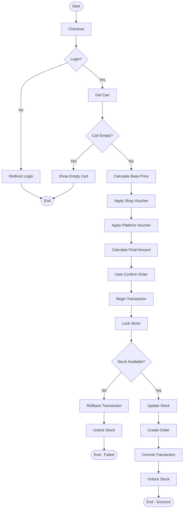
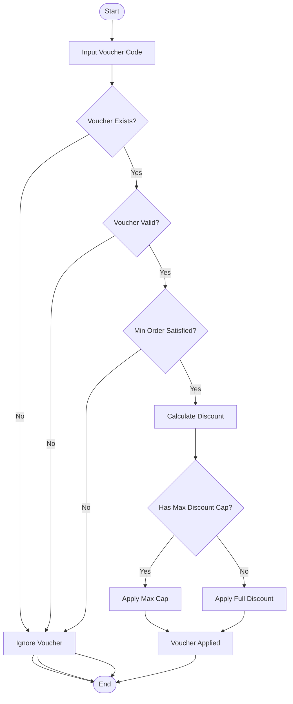
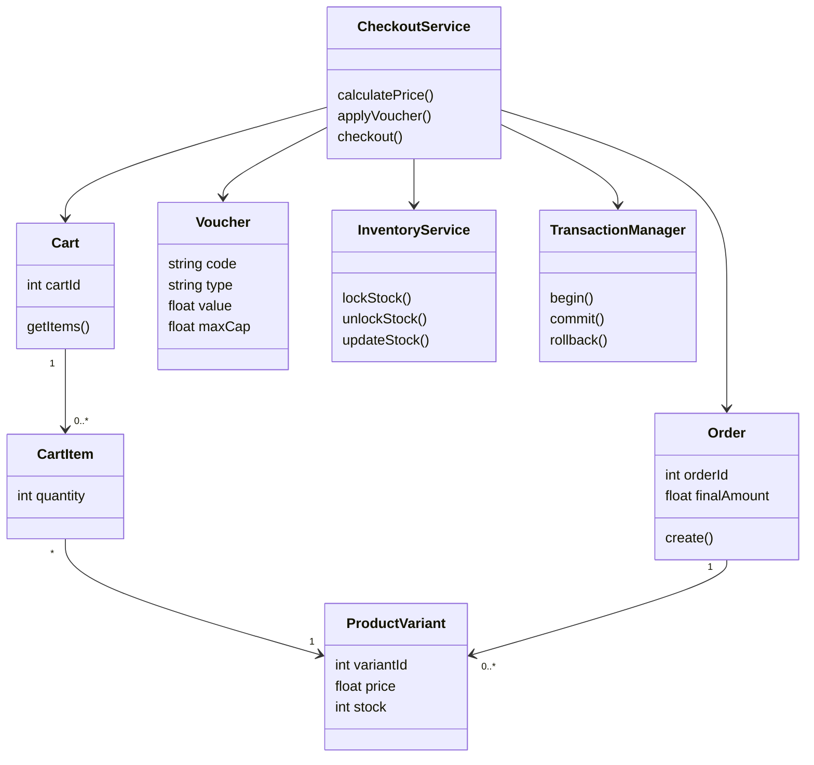

# Checkout & Voucher

## 1. Checkout Flow

```mermaid
graph TD
    S([Start]) --> A[Checkout]
    A --> B{Login?}
    B -->|No| B1[Redirect Login]
    B1 --> E0([End])
    B -->|Yes| C[Get Cart]
    C --> D{Cart Empty?}
    D -->|Yes| D1[Show Empty Cart]
    D1 --> E0
    D -->|No| E[Calculate Base Price]
    E --> G[Apply Shop Voucher]
    G --> H[Apply Platform Voucher]
    H --> I[Calculate Final Amount]
    I --> J[User Confirm Order]
    J --> K[Begin Transaction]
    K --> L[Lock Stock]
    L --> M{Stock Available?}
    M -->|No| N[Rollback Transaction]
    N --> U[Unlock Stock]
    U --> F1([End - Failed])
    M -->|Yes| O[Update Stock]
    O --> P[Create Order]
    P --> Q[Commit Transaction]
    Q --> R[Unlock Stock]
    R --> F2([End - Success])
```

## 2. Voucher Apply Flow

```mermaid
graph TD
    VS([Start]) --> VA[Input Voucher Code]
    VA --> VB{Voucher Exists?}
    VB -->|No| VX[Ignore Voucher]
    VX --> VE([End])
    VB -->|Yes| VC{Voucher Valid?}
    VC -->|No| VX --> VE
    VC -->|Yes| VD{Min Order Satisfied?}
    VD -->|No| VX --> VE
    VD -->|Yes| VF[Calculate Discount]
    VF --> VG{Has Max Discount Cap?}
    VG -->|Yes| VH[Apply Max Cap]
    VG -->|No| VI[Apply Full Discount]
    VH --> VJ[Voucher Applied]
    VI --> VJ
    VJ --> VE
```

## 3. Class Diagram – Checkout Module

```mermaid
classDiagram
    class Cart {
        int cartId
        getItems()
    }
    class CartItem {
        int quantity
    }
    class ProductVariant {
        int variantId
        float price
        int stock
    }
    class Voucher {
        string code
        string type
        float value
        float maxCap
    }
    class Order {
        int orderId
        float finalAmount
        create()
    }
    class CheckoutService {
        calculatePrice()
        applyVoucher()
        checkout()
    }
    class InventoryService {
        lockStock()
        unlockStock()
        updateStock()
    }
    class TransactionManager {
        begin()
        commit()
        rollback()
    }
    Cart "1" --> "0..*" CartItem
    CartItem "*" --> "1" ProductVariant
    Order "1" --> "0..*" ProductVariant
    CheckoutService --> Cart
    CheckoutService --> Voucher
    CheckoutService --> Order
    CheckoutService --> InventoryService
    CheckoutService --> TransactionManager
```
